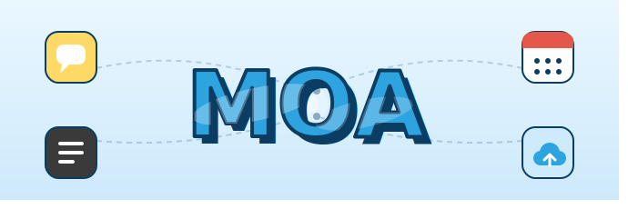

# MOA — Team Project Collaboration Platform

<p align="center">
  
</p>

MOA is a full-stack collaboration platform designed for university team projects. It combines task management, AI-powered meeting recording, file sharing, and contribution reporting into a single unified experience — available on both mobile (React Native) and web (React).

---

## Key Features

**Project Management**
- Create projects, invite teammates, and assign roles
- Track project status and deadlines with D-Day countdown

**Todo**
- Assign tasks to multiple members simultaneously
- Set difficulty level (Low / Medium / High) and date range
- Group todos by assignee

**Meetings**
- Record meetings and transcribe audio via **Daglo STT**
- Automatically generate meeting summaries using **OpenAI**
- QR code-based attendance check
- View meeting notes and attendance on web

**Drive**
- Team file sharing with folder navigation
- AI auto-organize: **OpenAI** analyzes file names and sorts them into topic-based folders

**Contribution Report**
- Score each member based on todo completion rate and meeting attendance
- AI-generated comments per member via **OpenAI**
- Difficulty-weighted scoring

**Chat**
- Project-scoped real-time chat
- Image and file attachments
- Unread message badge

**MeetPoll**
- Team availability voting with time-slot heatmap grid

---

## Tech Stack

| Layer | Technology |
|-------|-----------|
| Mobile App | React Native 0.81 + Expo 54, Expo Router, EAS Build, Google Play Store |
| Web | React + TypeScript, Vite, Cloudflare Pages (`moa-team.org`)<- you can connect this link |
| Backend | FastAPI (Python), Railway |
| Database | Supabase (PostgreSQL + Auth + Storage) |
| AI - STT | Daglo API |
| AI - NLP | OpenAI API |
| Email | Resend API + `moa-team.org` custom domain |

---

## Project Structure

```
Moa-mobilecomputing/
├── frontend/                       # Mobile app (React Native + Expo)
│   ├── app/
│   │   ├── (onboarding)/           # Login, Sign up
│   │   ├── (tabs)/                 # Home, Todo, Chat, More
│   │   └── (screens)/              # Project, Meeting, Drive, Report, etc.
│   └── src/services/api.ts         # API client with auto token refresh
│
├── frontend-web/                   # Web app (React + Vite)
│   └── src/
│       ├── pages/                  # Page components
│       └── api.ts                  # API client
│
└── backend/fastapi/                # Backend (FastAPI)
    └── app/
        ├── routers/                # API endpoints (auth, project, todo, meeting, drive, chat, report ...)
        ├── services/               # Business logic
        │   ├── ai.py               # OpenAI integration
        │   └── transcribe.py       # Daglo STT integration
        └── core/config.py          # Environment config
```

---

## Getting Started

### Prerequisites
- Node.js 18+
- Python 3.11+
- EAS CLI: `npm install -g eas-cli`

### Backend
```bash
cd backend/fastapi
python -m venv venv && source venv/bin/activate
pip install -r requirements.txt
cp .env.example .env   # fill in environment variables
uvicorn app.main:app --reload --host 0.0.0.0 --port 8000
```

### Web
```bash
cd frontend-web
npm install
npm run dev
```

### Mobile App
```bash
cd frontend
npm install
npx expo start
```

Build APK:
```bash
eas build --platform android --profile preview
```

---

## Environment Variables

**Backend (`backend/fastapi/.env`)**
```env
SUPABASE_URL=
SUPABASE_SERVICE_ROLE_KEY=
SUPABASE_ANON_KEY=
OPENAI_API_KEY=
DAGLO_API_KEY=
RESEND_API_KEY=
RESEND_FROM_EMAIL=noreply@moa-team.org
FIREBASE_CREDENTIALS_JSON=
```

**Web (`frontend-web/.env`)**
```env
VITE_API_BASE_URL=https://your-backend.railway.app
```

---

## Team

| Name | Role |
|------|------|
| 장현수 (Hyeonsoo Jang) | Backend, AI integration, GitHub management, Backend deployment |
| 손범관 (Bumkwan Son) | Mobile app frontend, Build & Google Play Store deployment |
| 송은상 (Eunsang Song) | Web frontend |
| 김혜민 (Hyemin Kim) | UI/UX Design, Figma, UX Flow |
